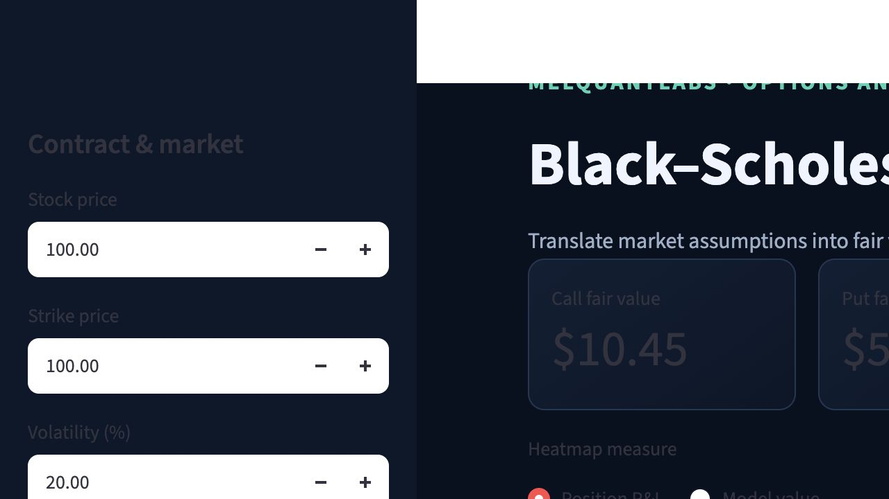
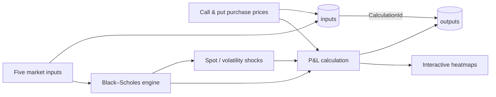
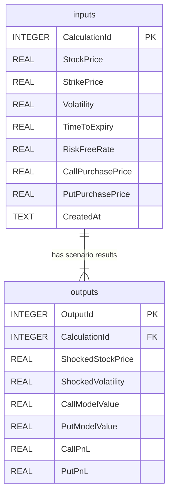

# MelQuantLabs Black–Scholes Scenario Lab

An interactive options workstation that turns five market inputs into European
call and put fair values, position P&L, and an auditable spot/volatility scenario
surface. It demonstrates the complete quant workflow: **inputs → model → risk
scenarios → visualisation → persisted outputs**.

> The project is intentionally compact. Pricing logic, persistence, and the UI
> are separate modules, but the architecture remains easy to explain in an
> interview or extend in a research setting.

## Why this matters

A single Black–Scholes price is only a point estimate. A trader or risk analyst
also needs to understand how that estimate changes when spot and implied
volatility move—and whether the resulting mark is above or below the price paid.
This lab makes those relationships visible and saves each experiment for review.

### What the dashboard answers

- What are the call and put worth under the same five market assumptions?
- What is the mark-to-model P&L relative to each purchase price?
- Where does P&L turn positive or negative as spot and volatility change?
- Can a saved input set be traced to every value on its scenario surface?

## Dashboard

The Streamlit interface includes:

- the five core inputs: stock price, strike, volatility, time to expiry, and
  risk-free interest rate;
- separate call and put purchase prices;
- call and put fair-value and P&L summary cards;
- red-to-green P&L heatmaps centered at zero;
- an optional model-value heatmap view;
- configurable scenario ranges and grid resolution; and
- a one-click save to a local SQLite database, plus recent-run history.



## Run locally

### Mac: one-click launcher

Double-click `launch_dashboard.command`. On first use it creates a private
Python environment and installs the required packages; after that, it starts the
dashboard and opens `http://127.0.0.1:8501` in the default browser. Keep the
small launcher window open while using the app and close it to stop the local
server. Calculation history remains on the Mac in `data/options_analytics.db`.

If macOS blocks the file after downloading it, Control-click it, choose
**Open**, then confirm **Open** once. Subsequent launches work normally.

### Terminal setup

From this folder:

```bash
python3 -m venv .venv
source .venv/bin/activate             # Windows: .venv\Scripts\activate
python3 -m pip install -r requirements.txt
streamlit run app.py
```

Streamlit prints the local browser address, normally `http://localhost:8501`.
The database is created automatically at `data/options_analytics.db` after the
app starts; calculation rows are added only when **Save calculation run** is
selected.

The original command-line analytics workstation remains available:

```bash
python3 options_analytics.py
```

## Model and P&L

For a non-dividend-paying European call and put:

```text
d1 = [ln(S/K) + (r + σ²/2)T] / (σ√T)
d2 = d1 - σ√T

Call = S·N(d1) - K·e^(-rT)·N(d2)
Put  = K·e^(-rT)·N(-d2) - S·N(-d1)

Call P&L = Call model value - Call purchase price
Put P&L  = Put model value  - Put purchase price
```

Where `S` is stock price, `K` is strike, `σ` is annualised volatility,
`T` is time to expiry in years, `r` is the continuously compounded risk-free
rate, and `N(·)` is the standard normal cumulative distribution function.
P&L is mark-to-model per option unit and excludes contract multipliers, fees,
bid/ask spread, and realised exercise proceeds.

## Architecture and data flow



| File | Responsibility |
| --- | --- |
| `options_analytics.py` | Dependency-free pricing, Greeks, implied volatility, parity, and scenarios |
| `database.py` | SQLite schema and atomic calculation-run persistence |
| `app.py` | Input validation, interactive metrics, heatmaps, and saved-run display |
| `test_options_analytics.py` | Reference values, model invariants, P&L, scenarios, and relational persistence |

## Database schema

SQLite keeps setup friction low while still demonstrating professional SQL:
primary and foreign keys, checks, a uniqueness constraint, an index, and atomic
parent/child writes.



One `inputs` row represents a reproducible calculation run. Its `outputs` rows
contain every point on that run's shocked spot/volatility grid. Purchase prices
are stored with the run because they define the P&L outputs, while the five core
fields remain clearly identifiable.

## Test it

No third-party packages are required for the model or database tests:

```bash
python3 -m unittest -v
```

The suite checks textbook call and put values, Greeks, put-call parity, implied
volatility recovery, no-arbitrage bounds, input validation, paired P&L, complete
scenario grids, and the one-to-many database relationship.

## Interview talking points

- **Model-to-market thinking:** fair value becomes decision-useful only after it
  is compared with the cost of the position.
- **Sensitivity analysis:** spot and volatility are shocked jointly because an
  option's risk is nonlinear and cannot be explained by one input at a time.
- **Visual semantics:** the P&L colour scale is symmetric around zero, so equal
  profits and losses receive equal visual weight; model values use a sequential
  scale because they are non-negative, not gains or losses.
- **Data lineage:** a generated `CalculationId` links one exact input set to all
  scenario results, and both tables are written in one transaction.
- **Separation of concerns:** pure pricing functions are testable independently
  of Streamlit and SQLite.
- **Pragmatic engineering:** SQLite is portable and reviewable locally; the
  normalized schema can later move to PostgreSQL or MySQL without changing the
  analytics contract.

## Assumptions and limitations

- European exercise; no early exercise.
- No dividends in the interactive paired-price workflow.
- Constant volatility and risk-free rate; lognormal underlying returns.
- Frictionless, liquid markets with continuous hedging.
- Purchase-price P&L is an instantaneous mark-to-model comparison, not a full
  trade lifecycle or expiry payoff.

Volatility smiles, jumps, discrete dividends, liquidity, and transaction costs
are intentionally outside this version. A natural next step is comparing the
surface with market option-chain data and observed implied volatilities.

This project is for education and research, not investment advice.
