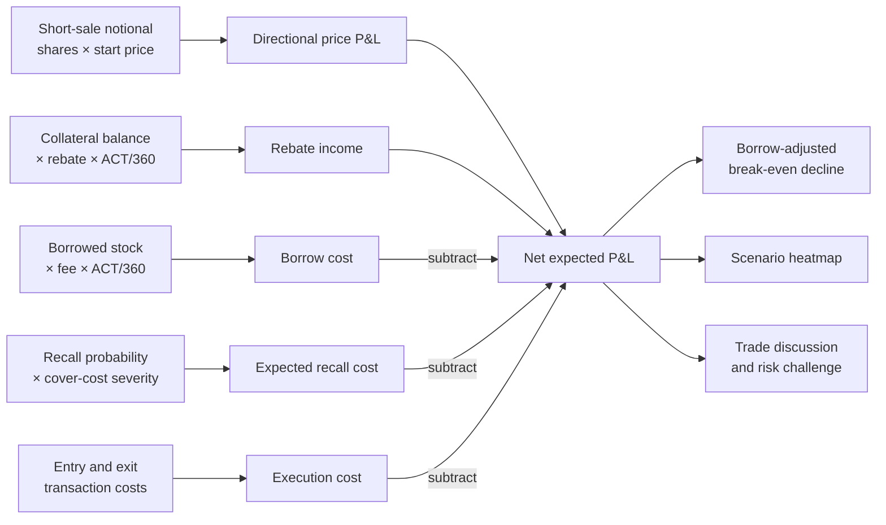
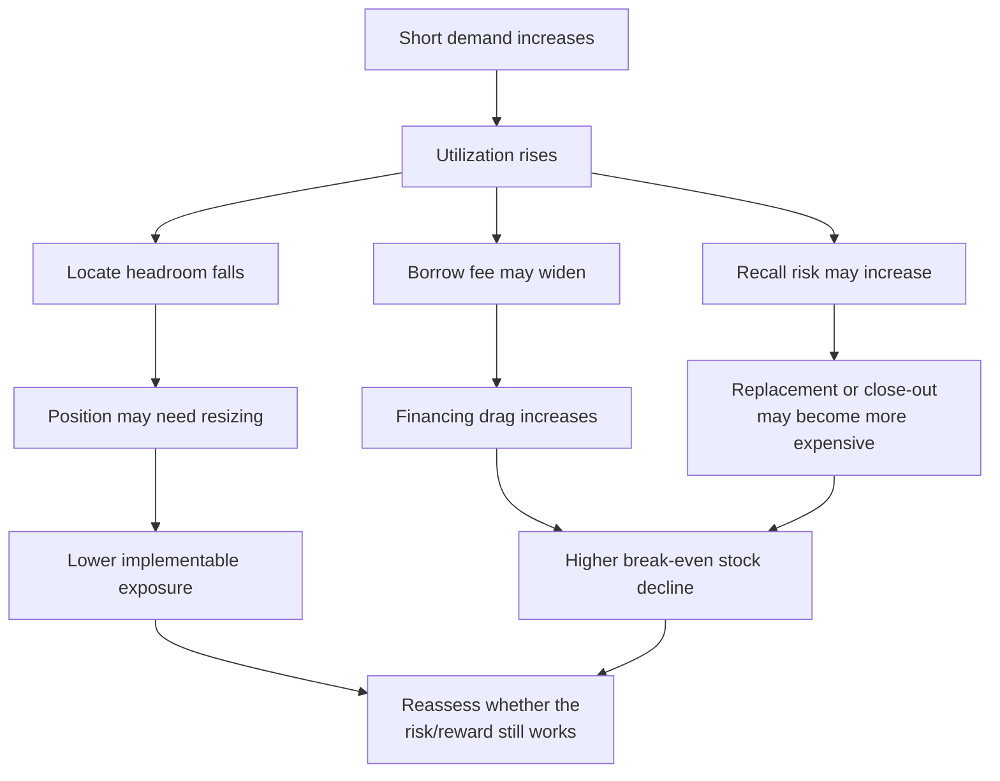
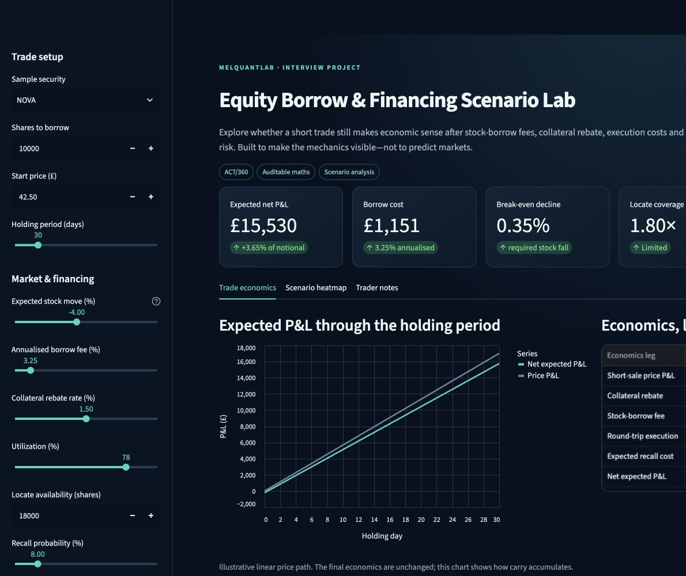
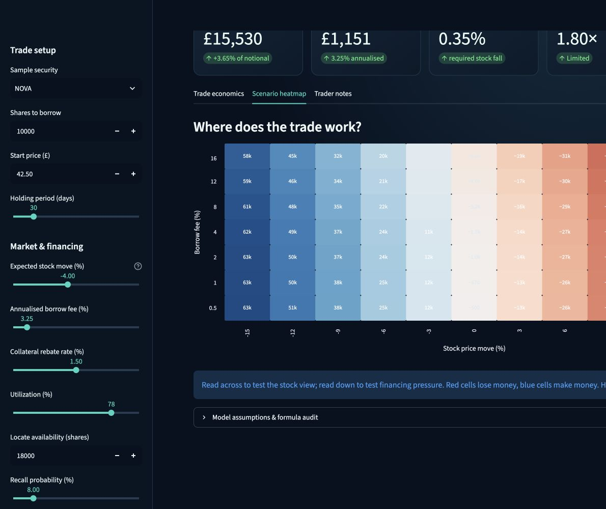
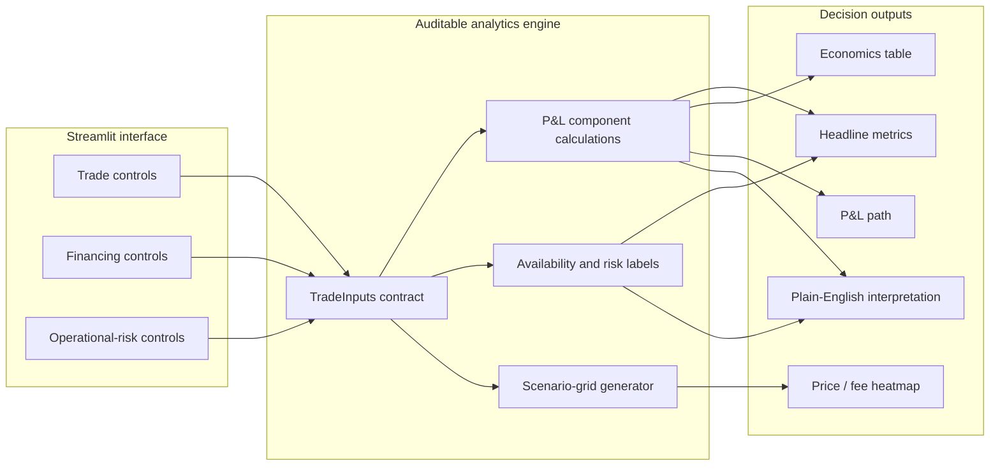

# Equity Borrow & Financing Scenario Lab

**An interactive decision lab for understanding the real economics of financing an equity short.**

Expressing a short view involves more than predicting where a share price will move. The position must be sourced, financed and maintained—and its profitability can change as borrow fees rise, inventory tightens or lenders recall stock. This Streamlit app brings those moving parts together in one clear, auditable scenario model.

The lab tests a practical trading-desk question: **after borrow fees, collateral rebate, execution costs and recall risk, is the trade still worth putting on?** Users can adjust the market and financing assumptions, inspect each component of expected P&L, and stress the trade across different stock-price moves and borrow-fee environments.

Built as a hands-on learning project for securities financing and equity finance trading opportunities, it demonstrates the ability to translate desk concepts into transparent calculations, interactive risk analysis and commercially relevant trading questions—while remaining accessible enough to explain confidently in an interview.

> **Project status:** Pre-release research software. The deterministic scenario engine and interface are working and tested; stochastic modelling and dynamic borrow-fee behaviour are documented future extensions, not current features.

## Research framing

### Core question

How do market direction, financing terms and stock-loan constraints combine to change the expected economics of an equity short?

### Contribution

The project does not propose a new pricing theory. Its contribution is an original, reproducible software implementation that brings normally separated considerations—directional P&L, borrow cost, collateral rebate, locate coverage, utilization and expected recall cost—into one auditable decision framework.

The distinctive output is a **borrow-adjusted break-even view**: the stock-price decline required for the short to recover its financing, execution and expected recall costs. A two-dimensional sensitivity surface then shows where the trade remains economic as both the stock view and borrow fee change.

## What the app does

- Builds a short-borrow scenario from shares, price, expected stock move and holding period.
- Separates price P&L, stock-borrow fee, collateral rebate, execution costs and expected recall cost.
- Flags locate coverage and a simple crowding/recall risk label using utilization and availability.
- Shows a P&L path and an interactive two-dimensional heatmap of stock moves versus borrow fees.
- Keeps every formula visible in plain English and in code.
- Includes sample inventory data for five fictional securities.

  

## Why this matters on a securities-financing desk

A directional short view is only one leg of the decision. Stock can become expensive or difficult to borrow; rebate can deteriorate; crowded inventory can be recalled; and a locate may not provide enough headroom for the intended order. The lab makes those frictions measurable without pretending to be a production risk system.

The key learning is that **trade P&L and financing P&L interact**. A correct stock call can still disappoint when borrow is tight, the holding period is long, or recall risk is costly.

## How the trade economics connect



This bridge makes the model auditable: every positive and negative contribution
to expected P&L can be inspected independently before it reaches the headline
result.

## Crowded-borrow stress chain



The arrows describe a stress narrative rather than a guaranteed causal law.
The current app lets the user challenge the individual assumptions; a future
dynamic model could estimate how they evolve together.

## A 60-second walkthrough

1. Choose a fictional security and enter the proposed position size.
2. Set the expected price move and holding period.
3. Adjust the borrow fee, collateral rebate, utilization, locate supply and recall assumptions.
4. Compare directional P&L with net expected P&L after financing and risk adjustments.
5. Use the heatmap to identify the combinations of price movement and borrow cost that make or break the trade.
6. Challenge the assumptions: ask which values are observable today, which may reprice and which are judgement-based estimates.

## Dashboard preview

The interface uses a dark navy and teal trading-workstation theme. The sidebar
controls the trade, financing and operational-risk assumptions; the main panel
shows headline economics, an auditable P&L bridge and an interactive price-move
versus borrow-fee heatmap.



The scenario tab makes the interaction between the directional view and the
cost of borrow immediately visible:



## Run locally

### Mac: one-click launcher

Double-click `launch_dashboard.command`. On first use, it creates a private
Python environment and installs the declared packages. It then opens the app at
`http://127.0.0.1:8501`. Keep the small launcher window open while using the
dashboard; closing it stops the local app.

If macOS blocks the downloaded launcher, Control-click it, choose **Open**, then
confirm **Open**. This is normally required only the first time.

### Terminal setup

```bash
python -m venv .venv
source .venv/bin/activate          # Windows: .venv\Scripts\activate
pip install -r requirements.txt
streamlit run app.py
```

Run the checks:

```bash
pytest -q
```

## Model and assumptions

The model uses the opening trade notional and an ACT/360 convention:

```text
Price P&L = shares × (start price − end price)
Borrow cost = notional × annual borrow fee × holding days / 360
Rebate income = notional × annual rebate rate × holding days / 360
Expected recall cost = notional × recall probability × cover-cost severity
Net P&L = price P&L + rebate − borrow − execution − expected recall cost
```

Negative stock moves benefit the short. Recall cost is an expected-value teaching simplification, not a forecast. The price path chart is linear for clarity; only its ending move drives final P&L.

The model deliberately excludes dividends/manufactured payments, margin, collateral haircuts, corporate actions, tax, settlement fails, intraday variation margin, dynamic fee paths and portfolio netting. Naming these omissions is part of demonstrating model judgment.

## Data provenance and interpretation

All securities, prices and inventory observations supplied with this repository are fictional. They are designed to demonstrate different financing conditions and must not be interpreted as live market data, executable locates or historical observations.

The app distinguishes three types of information:

- **Trade assumptions:** position size, expected price move and holding period.
- **Financing assumptions:** borrow fee, rebate and execution cost.
- **Operational-risk proxies:** utilization, locate coverage, recall probability and recall severity.

Keeping these categories visible helps prevent an estimated input from being mistaken for an observed fact.

## Reproducibility and validation

The calculation engine is separated from the Streamlit interface. Its automated tests verify:

- A falling share price improves short-position P&L.
- A higher borrow fee reduces net P&L.
- A locate shortfall is explicitly flagged.
- Borrow cost follows the stated ACT/360 convention.
- A flat share price still incurs financing, execution and expected recall costs.

These tests validate implementation behaviour, not the economic accuracy of user-entered assumptions.

## Architecture



```text
securities-financing-lab/
├── app.py                         # Streamlit presentation and interaction
├── analytics.py                   # Pure, testable calculation functions
├── launch_dashboard.command       # One-click Mac launcher
├── docs/images/                   # Verified dashboard screenshots
├── data/sample_inventory.csv      # Fictional learning dataset
├── tests/test_analytics.py        # Unit tests for core economic logic
├── .streamlit/config.toml         # Dark navy / teal visual theme
├── pytest.ini                     # Reproducible test discovery
├── requirements.txt
└── README.md
```

Keeping calculations outside the UI makes them easier to audit, test and reuse. `TradeInputs` provides one explicit contract for all assumptions.

## Interview talking points

1. **Start with purpose:** “I built this to connect a directional equity view to the cost and availability of financing the position.”
2. **Walk the economics:** Explain price P&L first, then add rebate, borrow fee, execution and expected recall cost one line at a time.
3. **Use the heatmap:** Show that a trade is a range of outcomes, not one point estimate. Explain the interaction between an adverse stock move and a widening borrow fee.
4. **Discuss operational reality:** A locate is not the same as a guaranteed term borrow. Utilization is a crowding signal, and lender concentration or recalls can matter even when today's fee looks manageable.
5. **Show control thinking:** Calculations are pure functions, assumptions are visible, sample names are fictional, and tests cover directionality, fee sensitivity, ACT/360 and locate shortfall.
6. **Acknowledge limits:** Explain what would be needed before using the model for real risk or trading decisions.

## Learning outcomes

- How equity borrow fees and cash-collateral rebates feed into short economics.
- Why utilization, lendable supply, locates and recalls matter alongside market direction.
- How to translate trading assumptions into auditable formulas.
- How scenario grids expose nonlinear decision pressure even when the core arithmetic is simple.
- How to separate analytics from presentation and test economically important behavior.

## Sensible next improvements

- Introduce an optional utilization-linked fee model and borrow-adjusted break-even frontier through time.
- Add joint normal, crowded-borrow and recall-stress scenario presets.
- Estimate probability of profit, Sharpe ratio, Value at Risk and Expected Shortfall from clearly documented simulations.
- Load live or end-of-day inventory and fee histories through an approved data source.
- Model fee changes and price changes day by day rather than as fixed endpoint assumptions.
- Add dividends/manufactured payments, collateral haircuts and margin funding.
- Simulate recalls with Monte Carlo paths and compare expected shortfall, not just expected cost.
- Add portfolio aggregation, issuer/sector concentrations and lender diversification.
- Persist named scenarios and export an interview-ready scenario report.
- Add data validation and a formal calculation-methodology document.

## Authorship, attribution and citation

This project is an original software implementation of established securities-financing concepts and standard financial arithmetic. It does not claim invention of the underlying market conventions, scenario-analysis techniques or any future Monte Carlo methods. External methods added in later versions will be cited in the methodology and release metadata.

Associated ORCID: [0009-0009-3338-223X](https://orcid.org/0009-0009-3338-223X)

Before the first public release, the repository will include a `CITATION.cff` file, an open-source licence and versioned release metadata. The archived release DOI—not an evolving branch—should be used for formal citation.

## Disclaimer

Educational project only. The fictional data and simplified outputs are not investment advice, trading recommendations, locates, or an offer of securities financing.
