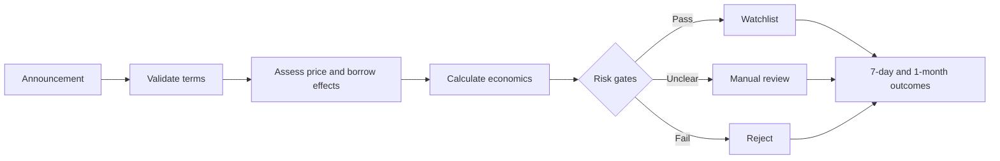
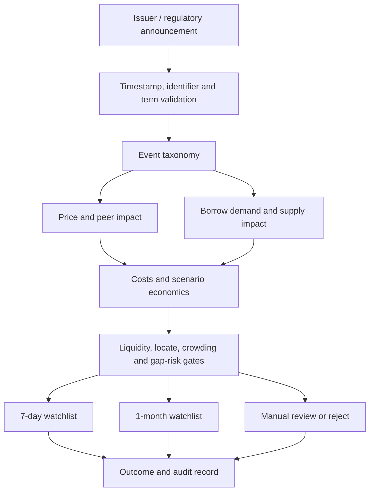
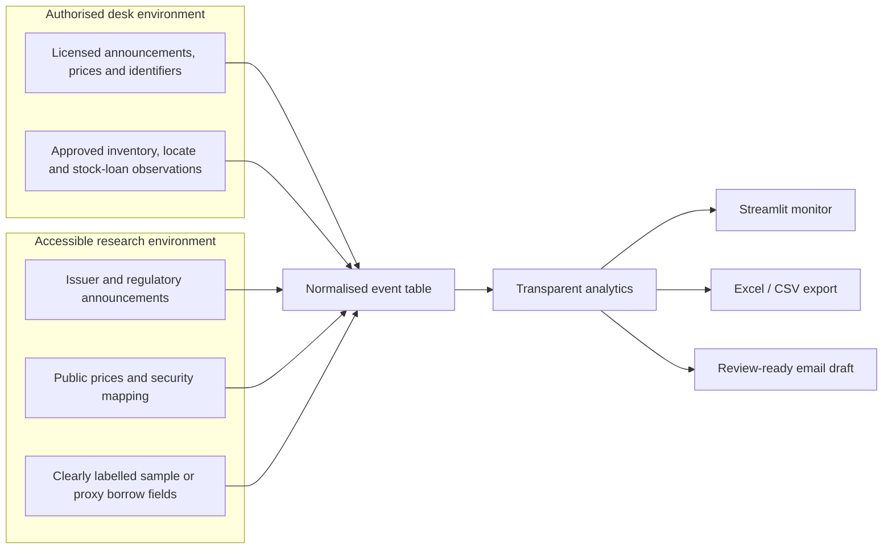
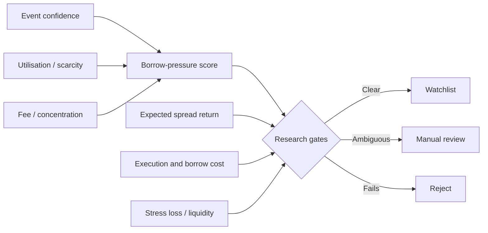
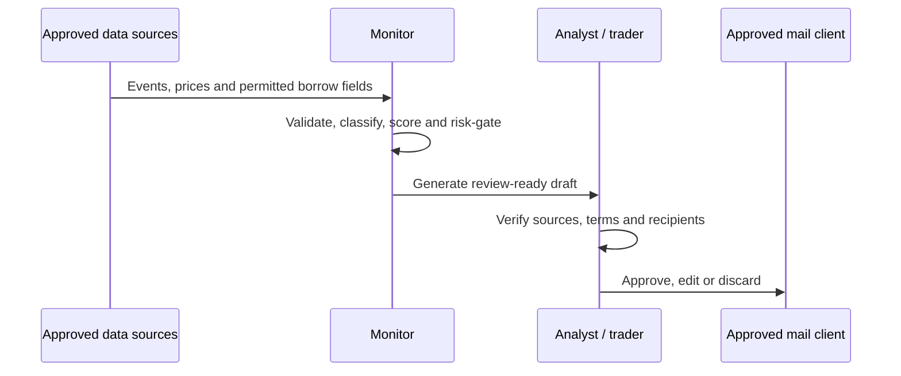

# Corporate Actions, Borrow & Relative-Value Monitor

> A risk-first decision lab for turning earnings and UK corporate events into prioritised inventory reviews, borrow-aware scenarios and auditable relative-value research candidates.

## Purpose

The project translates a practical desk problem into a repeatable workflow: announcements arrive quickly, but the consequences for price, peer relationships, hedging demand, lendable supply and recall risk are rarely visible in one place. The monitor connects four questions normally reviewed separately:

1. What did the company announce?
2. How could it affect equity price and peer relationships?
3. How could it change short demand, lendable supply or recall risk?
4. Does the opportunity remain attractive after costs and stressed downside?

The included sample covers:

- Earnings, trading updates and guidance changes
- Equity placings and rights issues
- Takeovers and mergers
- FTSE index additions and deletions

The architecture also anticipates dividends and capital returns, restructurings, regulatory events, tender offers, demergers, lock-up expiries and other supply-changing events. **Earnings remain a permanent part of the monitor**, not an optional extension.

It produces two deliberately separate outputs:

- **Borrow-pressure alerts:** where inventory, term or pricing may deserve review.
- **Relative-value research candidates:** where an event may create an actionable dislocation after estimated costs.

## Workflow



### Decision architecture



### Data-source modes



## Application views

- **Morning monitor:** prioritised event queue, inventory actions and decision mix.
- **Heatmaps:** event concentration and average borrow pressure by sector and event family.
- **Event drilldown:** transparent borrow-pressure inputs, trade economics and rejection reason.
- **Earnings lab:** earnings surprise, guidance change, stock reaction and peer-relative move.
- **Relative-value scenarios:** heatmap of net P&L across borrow-fee and spread outcomes.
- **Daily email draft:** a downloadable briefing produced for human validation before circulation.
- **Methodology:** formula disclosure, limitations and research status.

## Risk philosophy

No tool can guarantee that a trade will not lose money. This project instead requires every candidate to explain how it could lose money.

A candidate may be rejected because:

- Event terms are not sufficiently reliable.
- Locate availability is inadequate.
- Expected return fails to cover estimated costs.
- Liquidity is insufficient.
- Stressed loss exceeds the permitted research threshold.
- The reward is too small relative to the downside.

## Transparent prototype methodology

The borrow-pressure indicator combines:

- Event-type research prior
- Utilization
- Lender concentration
- Availability scarcity
- Current fee signal
- A capped issuance effect

These coefficients are illustrative research priors, not fitted predictions. They must be validated using point-in-time institutional securities-finance data before any production use.

Net expected return deducts simple estimated borrow and execution costs from the gross spread view. Every calculation is contained in `analytics.py` and covered by unit tests.

### Candidate triage



The score is a prioritisation aid rather than a prediction. A high score means “review inventory and economics sooner”; it does not mean “short the stock.”

## Daily briefing workflow



The application never sends an email. It creates a plain-text draft that makes source validation and human approval explicit. In an authorised institutional environment, the same template could be populated with licensed event data and approved internal inventory fields. The portfolio version uses sample/proxy borrow observations and public or permitted sources.

## Run locally

```bash
python -m venv .venv
source .venv/bin/activate
pip install -r requirements.txt
streamlit run app.py
```

On macOS, you can also double-click `launch_dashboard.command` after making it executable once:

```bash
chmod +x launch_dashboard.command
```

Run the tests:

```bash
pytest
```

## Repository structure

```text
corporate-actions-borrow-rv-monitor/
├── app.py
├── analytics.py
├── data/
│   └── sample_events.csv
├── tests/
│   └── test_analytics.py
├── requirements.txt
├── pytest.ini
├── launch_dashboard.command
└── README.md
```

## Data status

All companies, announcements and borrow observations supplied with the prototype are illustrative. The sample dataset is designed to demonstrate workflow and calculations without representing current investment recommendations.

A research release may use public announcements and permitted market data. A production-quality borrow model would require authorised point-in-time histories of fees, availability, utilization, lender concentration, locates and recalls.

### Data-quality controls

| Risk | Required control |
|---|---|
| Duplicate or amended announcements | Preserve issuer, timestamp, source URL and version; prefer the latest validated terms. |
| Look-ahead bias | Use only fields available at the decision timestamp. |
| Identifier changes | Maintain dated ticker, ISIN and SEDOL mappings. |
| Survivorship bias | Retain delisted, acquired and failed issuers in historical tests. |
| Public borrow proxies | Label them clearly and avoid presenting them as executable availability. |
| Stale prices or fees | Show observation timestamps and reject stale inputs. |
| Ambiguous event terms | Route to manual review rather than inferring missing economics. |

## Backtest design

A defensible event study should freeze the investable universe and information set at each timestamp, then measure forward outcomes separately over seven trading days and one month. It should report coverage, missingness, turnover, hit rate, average and median return, drawdown, tail loss and cost sensitivity. Pair candidates should be compared with simple sector- or factor-matched baselines. Small or synthetic samples must be described as demonstrations, not evidence of a profitable strategy.

## Next research steps

1. Create a timestamped historical announcement dataset.
2. Add point-in-time FTSE membership and identifier histories.
3. Build defensible peer selection using sector, beta, size and liquidity.
4. Add event-time seven-day and one-month backtests.
5. Include transaction, dividend, financing and borrow costs.
6. Validate borrow-pressure indicators against authorised stock-loan observations.
7. Add controlled Excel export for the morning meeting.
8. Add a SQL event store and ingestion audit table.
9. Add an optional Excel/VBA refresh example for desk users.

## Disclaimer

This project is educational research software. It is not investment advice, an execution system or a guarantee of profit. All corporate-action terms, prices, borrow conditions and risks require independent verification.
