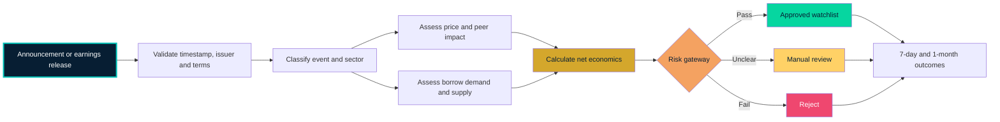
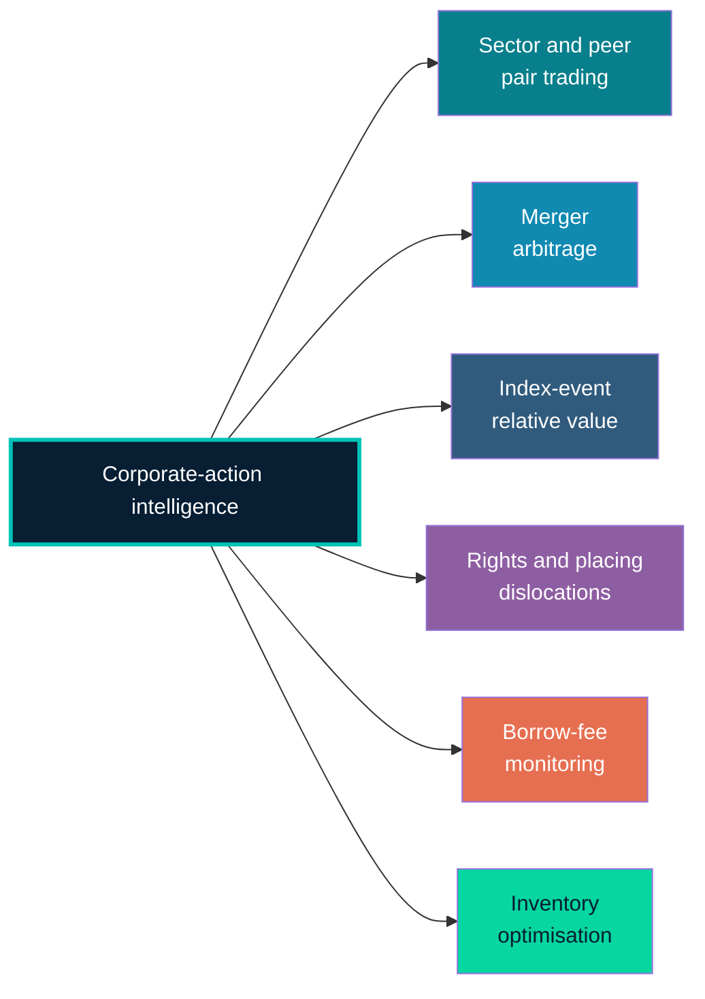
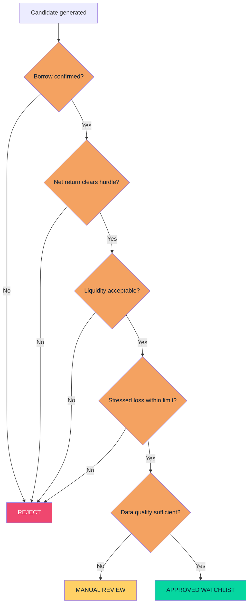
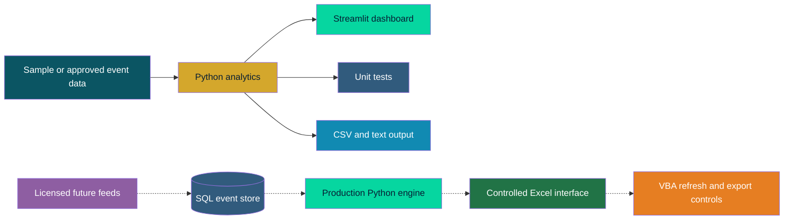
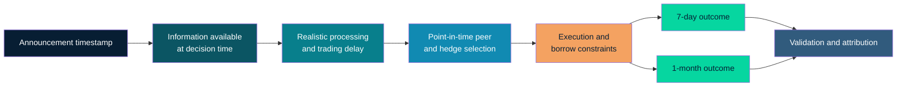

# Corporate Actions, Borrow & Relative-Value Monitor

### From public disclosures to risk-controlled trading and securities-finance decisions


> **Desk question:** Which newly announced event could change an equity's price, borrow demand, lendable supply, financing economics or settlement risk—and what should the desk review first?

This is a working, risk-first research application for UK and European corporate actions, earnings and securities-finance signals. It converts a noisy announcement queue into prioritised inventory reviews, borrow-aware scenarios and auditable relative-value candidates over **seven-day** and **one-month** horizons.

The goal is not to rank the most dramatic headline. It is to identify the opportunity with the clearest catalyst, strongest net economics, most dependable borrow and most acceptable downside.

---

## Why this tool exists

Corporate actions are rarely “just events.” A placing can expand lendable supply while pressuring price. An index deletion can create directional flow, hedging demand and temporary borrow pressure. A takeover can alter recall risk, settlement requirements and spread economics. Earnings can reprice both an issuer and its peer group within seconds.

The monitor joins five questions that are often reviewed separately:

| Desk question | Output |
|---|---|
| What happened? | Normalised event type, terms, dates and source fields |
| What could move? | Directional, peer-relative and supply/demand hypotheses |
| What happens to borrow? | Fee, availability, utilization, concentration and recall review |
| Is the trade still economic? | Gross view less borrow and execution costs |
| What can go wrong? | Stress loss, liquidity constraint and rejection reason |

### Commercial uses

| Trading | Securities finance | Risk and operations |
|---|---|---|
| Event-driven research | Inventory planning | Event and timetable control |
| Pair-trade screening | Locate prioritisation | Settlement-risk review |
| 7-day and 1-month watchlists | Fee-pressure monitoring | Manual-review queue |
| Scenario and break-even analysis | Recall-risk flags | Data lineage and audit trail |

---

## Announcement-to-decision workflow



The workflow deliberately separates two outputs:

- **Borrow-pressure alerts** identify names where inventory, term, pricing or recall exposure deserves review.
- **Relative-value research candidates** identify dislocations that may remain attractive after estimated costs and risk gates.

A high score means **review sooner**. It is not an instruction to short the stock.

---

## What the working application does

The Streamlit interface contains ten connected views:

1. **Morning monitor** — prioritised events, inventory actions and decision mix.
2. **Heatmaps** — event concentration and average borrow pressure by sector and event family.
3. **Event drilldown** — transparent score inputs, economics and rejection reasons.
4. **Earnings lab** — earnings surprise, guidance change, issuer reaction and peer-relative move.
5. **Relative-value scenarios** — net P&L across spread outcomes and borrow-fee assumptions.
6. **Desk economics** — fee-repricing and retained-revenue attribution.
7. **Daily email draft** — a review-ready briefing for validation before circulation.
8. **Integration roadmap** — Bloomberg, SQL and controlled Excel/VBA operating model.
9. **Data controls** — universe overlap, freshness, schema exceptions and decision audit.
10. **Methodology** — formulas, assumptions, limitations and data status.

### Demonstration universe

The public build uses eight fictional securities with explicit demonstration memberships across the intended European coverage model:

- FTSE 100
- FTSE 250
- EURO STOXX 50
- STOXX Europe 600

These are not real constituent claims. The dated security master demonstrates de-duplication, overlapping membership, identifiers, country, currency and effective dates. Real current and historical constituents require an authorised point-in-time source.

### Dashboard concept

```text
┌─────────────────────────────────────────────────────────────────────┐
│ CORPORATE ACTIONS, BORROW & RV MONITOR                07:15 London │
├──────────────────────┬─────────────────────┬────────────────────────┤
│ EVENT QUEUE          │ BORROW WATCH        │ RISK ALERTS            │
│ New announcements    │ Tightening names    │ Manual reviews         │
│ High-priority events │ Potential specials  │ Approaching elections  │
├──────────────────────┴─────────────────────┴────────────────────────┤
│ PRIORITISED OPPORTUNITIES                                           │
│ LONG       SHORT      EVENT       7D    1M    BORROW     DECISION   │
│ Company A  Company B  Buyback     +     +     Stable     WATCH      │
│ Company C  Company D  Placing     +     0     Tightening REVIEW     │
│ Company E  Company F  Takeover    +     +     Expensive  REJECT     │
├─────────────────────────────────────────────────────────────────────┤
│ SELECTED IDEA                                                       │
│ Thesis │ Hedge ratio │ Net P&L │ Stress loss │ Catalyst │ Risks     │
└─────────────────────────────────────────────────────────────────────┘
```

---

## Event coverage

**Earnings are a permanent part of the monitor—not an optional extension.**

| Event family | Illustrative implications |
|---|---|
| Earnings, trading update or profit warning | Gap risk, peer repricing, short-demand change |
| Rights issue or placing | Dilution, new supply, hedging and settlement demand |
| Cash acquisition or share merger | Spread risk, elections, recalls and conversion terms |
| Buyback, tender or special dividend | Float reduction, lender recall and dividend obligation |
| Spin-off, demerger or restructuring | New securities, allocation terms and settlement complexity |
| FTSE inclusion or deletion | Passive flow, liquidity shift and temporary dislocation |
| Convertible issuance | Delta hedging and potential borrow demand |
| AGM or shareholder vote | Catalyst timing and outcome uncertainty |
| Delisting or insolvency event | Exit liquidity, settlement and closeout risk |

---

## Relative-value research

The first version prioritises economic explanation over model complexity. Each candidate must explain **why** a relationship may move rather than merely report a correlation.



```text
LONG / SHORT  →  event thesis  →  expected convergence or divergence
               →  7-day view  →  1-month view
               →  borrow and cost adjustment
               →  risk gates  →  watch / review / reject
```

Peer selection should ultimately require sector and business similarity, a stable historical relationship, a defensible hedge ratio, sufficient liquidity, available borrow and no conflicting event in the hedge security.

---

## Borrow-adjusted economics

The core decision metric is net expected P&L, not raw spread return.

```text
Expected net P&L
= Expected long P&L
+ Expected short P&L
− Borrow fees
− Financing costs
− Execution costs
− Dividend obligations
− Expected recall and closeout costs
```

The prototype implements transparent directional/spread economics, borrow fees and execution costs. Financing, dividend obligations and probabilistic recall/closeout costs are documented extensions requiring suitable data.

| Scenario | Price relationship | Borrow fee | Availability | Desk response |
|---|---:|---:|---:|---|
| Base | Expected convergence | Current | Stable | Evaluate |
| Borrow stress | Unchanged | Higher | Reduced | Recalculate |
| Failed catalyst | Adverse divergence | Higher | Reduced | Apply risk limit |
| Recall | Forced or accelerated exit | Accrued | Unavailable | Closeout review |
| Best case | Faster convergence | Stable | Stable | Take-profit review |

---

## Risk gateway

No tool can guarantee that a trade will not lose money. The application instead requires every candidate to show how it could lose money and why it should be rejected.



The working prototype exposes expected and stressed economics, borrow-fee sensitivity, locate availability, utilization, lender concentration, recall-risk category, liquidity, catalyst horizon, data freshness and reasons not to trade. Position sizing, controlled overrides and approval history belong to a later desk-integration phase.

---

## Transparent prototype methodology

The borrow-pressure indicator combines:

- Event-type research prior
- Utilization
- Lender concentration
- Availability scarcity
- Current fee signal
- A capped issuance effect

These coefficients are illustrative research priors, not fitted predictions. Every implemented calculation is contained in `analytics.py` and covered by unit tests.

Net expected return deducts simple estimated borrow and execution costs from the gross spread view. The scenario heatmap then shows whether a candidate remains economic when both the spread outcome and borrow fee change.

---

## Data-source modes


### Source hierarchy

| Priority | Source type | Intended use |
|---:|---|---|
| 1 | Regulatory Information Service / RNS | Timely announcement detection |
| 2 | Exchange corporate-action data | Structured terms and timetables |
| 3 | FCA National Storage Mechanism | Official archive and validation |
| 4 | Issuer circulars and prospectuses | Detailed event terms |
| 5 | Licensed market data | Prices, volumes, indices and identifiers |
| 6 | Licensed or internal stock-loan data | Fees, availability, utilization and recalls |
| 7 | Public discovery services | Prototype discovery only, subject to terms |

> **Data principle:** A publicly visible webpage is not automatically suitable for bulk collection, redistribution or production trading. Licensing, terms of use, latency, coverage and completeness must be reviewed before implementation.

All companies, announcements and borrow observations shipped with this repository are illustrative. They demonstrate workflow without representing current recommendations or executable availability.

### Data-quality controls

| Risk | Required control |
|---|---|
| Duplicate, corrected or withdrawn announcements | Preserve source, timestamp and version; route material amendments for review |
| Look-ahead bias | Use only information available at the decision timestamp |
| Identifier changes | Maintain dated ticker, LEI, ISIN and SEDOL mappings |
| Survivorship bias | Retain delisted, acquired and failed issuers in historical tests |
| Stale prices, fees or locates | Display observation time and reject stale inputs |
| Ambiguous event terms | Route to manual review instead of inferring missing economics |
| Public borrow proxies | Label clearly and never present as executable inventory |

---

## Daily briefing design


The application does **not** send email. It generates a plain-text draft that requires human validation. In a Bloomberg-enabled desk environment, the same workflow could consume licensed announcement, reference-data and securities-finance feeds through approved interfaces. In a standard enterprise environment, it could use permitted issuer/RNS feeds and hand a reviewed draft to an approved mail client. Recipient selection, release and audit controls must remain within the institution's authorised infrastructure.

---

## Architecture: working prototype and desk roadmap



**Implemented now:** Python analytics, Streamlit interface, validated sample data, an in-memory DuckDB read model, dated demonstration security master, Excel/text/CSV outputs, decision audit, freshness controls and automated tests.

**Planned institutional extension:** SQL lineage store, licensed feeds, controlled Excel view and narrow VBA automation. Core calculations should remain visible and testable in Python; VBA should automate approved workflow steps rather than conceal analytics.

---

## Backtest design

A defensible event study must reproduce what could actually have been known and traded at the time.



Controls must include point-in-time constituents, delisted names, realistic delay, spreads, commissions, market impact, borrow fees, dividend obligations, financing, locate availability, recall stress and announcement corrections.

Reporting should include average and median return, hit rate, Sharpe and Sortino ratios, maximum drawdown, expected shortfall, turnover, cost-to-gross-alpha ratio, sector/event/liquidity attribution, long and short contribution, pre/post-borrow performance, stressed fees, rejection rate and results excluding the five strongest trades.

The repository does not yet claim a validated historical strategy. The current sample demonstrates the workflow and calculations; the point-in-time event dataset and full backtest remain future research.

---

## Run locally

```bash
python -m venv .venv
source .venv/bin/activate
pip install -r requirements.txt
streamlit run app.py
```

On macOS, `launch_dashboard.command` provides a double-click launcher after it has been made executable once:

```bash
chmod +x launch_dashboard.command
```

Run the tests:

```bash
pytest
```

```text
corporate-actions-borrow-rv-monitor/
├── app.py
├── analytics.py
├── data_store.py
├── validation.py
├── reporting.py
├── data/
│   ├── sample_events.csv
│   └── security_master.csv
├── tests/
│   ├── test_analytics.py
│   ├── test_app.py
│   └── test_data_controls.py
├── requirements.txt
├── pytest.ini
├── launch_dashboard.command
└── README.md
```

---

## Development roadmap

### Phase 1 — Working monitor ✅

- Sample UK and European event universe
- Earnings and corporate-action classification
- Sector mapping and event drilldown
- Borrow-pressure prioritisation
- Seven-day and one-month horizons
- Scenario heatmaps, email draft and tests

### v0.3 — Data and controls ✅

- DuckDB-backed event and security views
- Dated European demonstration security master
- Index, country and currency filters
- Pydantic schema validation and exception routing
- Data-freshness indicators
- Session decision audit with override reasons
- Controlled multi-sheet Excel export
- Permanent Streamlit render test
- GitHub Actions test workflow

### Phase 2 — Relative-value research

- Point-in-time peer selection and historical spread analysis
- Beta-adjusted hedge ratios
- Transaction, dividend, financing and borrow costs
- Position sizing and risk budgeting

### Phase 3 — Historical validation

- Timestamped announcement database
- Point-in-time FTSE membership and identifier histories
- Event studies by sector, event and liquidity bucket
- Borrow and recall stress tests
- Out-of-sample validation and model-risk review

### Phase 4 — Controlled desk integration

- Authorised event, price and stock-loan feeds
- SQL event and decision history
- Excel morning-meeting interface
- Narrow VBA refresh and export controls
- Inventory matching and approval workflow

---

## What this project is—and is not

> **This project is:** an auditable research and decision-support framework connecting corporate actions, earnings, relative-value analysis, securities-finance economics and risk controls.

> **This project is not:** a guarantee of profit, an autonomous execution system, investment advice or a substitute for verified event instructions, confirmed locates and professional risk oversight.

## Core design principle

> **Do not rank the most exciting announcement first. Rank the opportunity with the strongest net economics, clearest catalyst, most dependable borrow and most acceptable downside first.**
