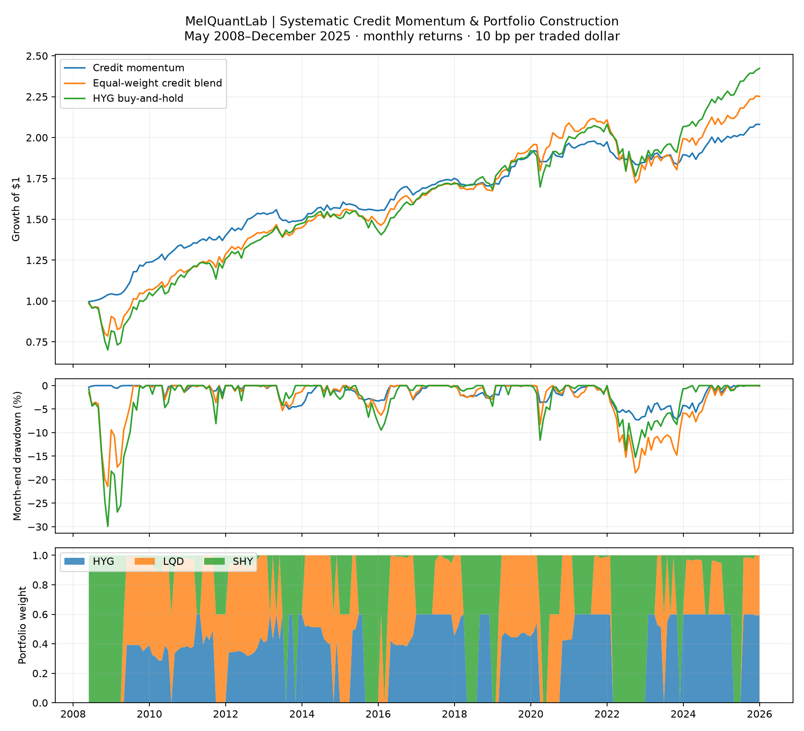
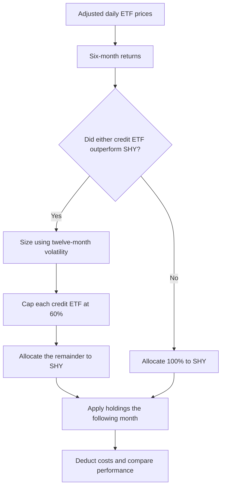

# Systematic Credit Momentum & Portfolio Construction

Status: **Research implementation complete; historical results reproduced.**

**May 2008–December 2025: Sharpe versus SHY 0.70 versus HYG buy-and-hold 0.39.**
Annualised return was **4.23% versus 5.14%**; month-end maximum drawdown was
**−7.31% versus −29.92%**. The strategy reduced risk and sacrificed return.
In 2016–2025 its Sharpe was **0.37 versus HYG 0.54**, so the evidence does not
support a persistent advantage across periods.

> Can a fixed credit momentum rule improve portfolio resilience after costs,
> compared with passive credit exposure?



## Purpose

**Can changing our credit exposure each month reduce losses while still earning
reasonable returns?** This project tests that question using a fixed set of
investment rules and historical ETF data.

It connects two decisions: which credit investments have been performing well,
and how much money to allocate to them. The goal is to measure the trade-off
between return and risk after trading costs, rather than assume momentum works.

## Who is this for?

- **Researchers** testing systematic investment ideas.
- **Portfolio managers** exploring ways to control credit exposure.
- **Learners** studying Python, backtesting and portfolio allocation.
- **Recruiters and reviewers** assessing the code, research process and conclusions.

The current project supports research and comparison. Live portfolio use would
require further validation of data, execution and risk controls.

## How it works

| ETF | Portfolio role |
| --- | --- |
| HYG | US high-yield corporate bonds |
| LQD | US investment-grade corporate bonds |
| SHY | Short-term US Treasury bonds, used for defensive allocation |

Each month, the program:

1. Calculates each ETF's return over the previous six months.
2. Checks whether HYG or LQD performed better than SHY over that period.
3. Measures each credit ETF's monthly return volatility over the previous twelve months.
4. Allocates to qualifying credit ETFs, giving more weight to the less volatile ETF.
5. Caps each credit ETF at 60% and puts the remaining allocation into SHY.
6. Applies those holdings the following month, deducts trading costs and records results.

If only HYG qualifies, the portfolio holds **60% HYG and 40% SHY**. If neither
credit ETF qualifies, it holds **100% SHY**. If both qualify, their relative
volatility determines the starting weights before the caps are applied.



Using the allocation the following month prevents a closing signal from earning
returns that occurred before the signal was available. Execution still assumes
an idealised month-end closing rebalance.

This is **ETF total-return momentum**. It does not isolate issuer-level spread
momentum or remove interest-rate exposure. SHY can lose value; it is a Treasury
investment rather than literal cash. Results are in USD without a GBP currency hedge.

## 3. How did I test it?

| Component | Fixed baseline |
| --- | --- |
| Universe | HYG, LQD, SHY; chosen retrospectively, no changing universe |
| Data | Yahoo Finance adjusted daily closes, distributions/splits included |
| Observation | Last available trading close each calendar month |
| Signal | Credit ETF trailing 6-month return must exceed SHY's 6-month return |
| Sizing | Inverse trailing 12-month monthly volatility among eligible credit ETFs |
| Constraint | Each credit ETF capped at 60%; residual allocated to SHY |
| Timing | Month-end signal sets the following month's holdings |
| Execution | Idealised month-end closing rebalance; next-session open/slippage not modelled |
| Cost | 10 bp per dollar bought or sold, including SHY; 100% switch incurs 20 bp |
| Rebalancing | Monthly, turnover measured against weights drifted by asset returns |
| Benchmark 1 | HYG purchased once; same initial trading cost; no forced final liquidation |
| Benchmark 2 | 50/50 HYG/LQD, monthly rebalanced with the same turnover/cost model |
| Sharpe | Monthly return minus realised SHY return, annualised with √12 |
| Drawdown | Month-end equity including initial capital of 1; intramonth losses not measured |

The aligned daily sample starts 11 April 2007. After 12 months of return history,
April 2008's signal sets May's allocation. Evaluation comprises **212 monthly
returns**, starting with the return from 30 April to 30 May 2008 and ending
31 December 2025. HYG launched in April 2007, so a 2005 start would require
a different dataset; earlier prices have not been fabricated or backfilled.

The rule and constraints are fixed for this implementation. This is a
retrospective study, **not a preregistered or untouched out-of-sample test**.
The split below checks period dependence; parameters are not tuned separately.

### Full-sample results after modelled trading costs

| Metric | Credit momentum | 50/50 credit blend | HYG buy-and-hold |
| --- | ---: | ---: | ---: |
| Annualised return | 4.23% | 4.70% | 5.14% |
| Annualised volatility | 4.21% | 8.72% | 10.43% |
| Sharpe versus SHY | 0.70 | 0.41 | 0.39 |
| Month-end maximum drawdown | −7.31% | −21.42% | −29.92% |
| Total return | 108.05% | 125.18% | 142.31% |

Average credit allocation was **68.08%**. Annualised two-sided turnover was
**3.67× NAV**, approximately 36.7 bp/year of additive modelled cost before
compounding. This is not a live audited track record.

### Period dependence

| Period | Momentum CAGR | HYG CAGR | Momentum Sharpe | HYG Sharpe |
| --- | ---: | ---: | ---: | ---: |
| May 2008–December 2015 | 5.91% | 4.76% | 1.06 | 0.31 |
| January 2016–December 2025 | 2.97% | 5.43% | 0.37 | 0.54 |

Period metrics use realised monthly returns from the continuous backtest;
the portfolios are not restarted or charged a new entry cost at the split.

[Machine-readable metrics](docs/metrics.json),
[monthly holdings, turnover and returns](docs/monthly_allocations.csv),
[3/6/12-month momentum × 0/10/25 bp sensitivity](docs/sensitivity.csv), and
[retrieval details and input checksum](docs/data_manifest.json) accompany the report.
Sensitivity is published in full; it is not used to replace the six-month baseline.
At 10 bp, three-month momentum has a Sharpe of **0.37** and twelve-month momentum
**0.51**. Raising baseline costs to 25 bp reduces its Sharpe to **0.55**.
The result depends materially on the lookback and trading assumptions.

## What is the Sharpe ratio, and why does it matter?

The Sharpe ratio measures **average excess return per unit of variability in
that excess return**. It helps judge the reward earned alongside the fluctuations
experienced. A Sharpe of 0.70 does **not** mean a 70% return.

This project uses SHY as the reference:

```text
Monthly excess return = portfolio return − SHY return

Annualised Sharpe =
mean monthly excess return / standard deviation of monthly excess returns × √12
```

The label **Sharpe versus SHY** makes that choice visible. SHY is not risk-free,
so this measure differs from a Sharpe calculated using a risk-free cash rate.
The √12 conversion is the conventional monthly annualisation; serial correlation
can make that approximation less reliable.

Sharpe matters because the strategy aims to reduce risk. Over the full sample,
it earned less than HYG, but had a higher Sharpe and a smaller month-end drawdown.
In 2016–2025, HYG had the higher Sharpe. We therefore assess Sharpe alongside
return, drawdown, trading costs and period-by-period results.

Sharpe does not fully describe crash risk or establish future performance.
See [William Sharpe's explanation and limitations](https://web.stanford.edu/~wfsharpe/art/sr/sr.htm).

## Strengths and weaknesses

| Strength | Why it matters |
| --- | --- |
| Clear rules | Every allocation can be explained and inspected |
| Lagged signals | Holdings use information available in the previous month |
| Trading costs included | Changing positions is not treated as free |
| Allocation caps | Neither credit ETF can take the entire portfolio |
| Reproducible evidence | Code, holdings, inputs and tests accompany the conclusions |
| Honest comparisons | Periods of underperformance are retained |

| Weakness | Effect on the conclusion |
| --- | --- |
| Slow signals | Six-month momentum can miss sudden crashes or rapid recoveries |
| Missed gains | Defensive allocations can reduce long-term returns |
| Narrow universe | Two selected credit ETFs do not represent all credit strategies |
| Mixed return drivers | Rates, credit spreads and income all affect the results |
| Simplified execution | Real trading costs and fill prices could be worse |
| Month-end drawdowns | Larger losses within a month can be hidden |
| Period dependence | The full-sample advantage did not persist in the later subperiod |

## Data: why Yahoo Finance?

The project downloads daily ETF prices from **Yahoo Finance through `yfinance`**,
then selects monthly observations. `yfinance` is an independent Python tool,
not an official Yahoo-supported library. Its documentation describes research
and education as its intended use. [yfinance documentation](https://ranaroussi.github.io/yfinance/).

### Advantages

- **Accessible:** the project can be run without a specialist market-data terminal.
- **Convenient:** Python can download the three ETF histories together.
- **Historical coverage:** the downloaded sample includes several market conditions.
- **Adjusted prices:** splits and distributions are reflected in the return series.
  This matters for bond ETFs because income is part of investor returns.
  [Yahoo's adjusted-close explanation](https://help.yahoo.com/kb/SLN28256.html).

### Limitations

- **Possible errors:** missing prices and incorrect dividend, split or currency
  adjustments are documented possibilities. This is not evidence that our particular
  sample contains those errors. [Data-repair documentation](https://ranaroussi.github.io/yfinance/advanced/price_repair.html).
- **Access dependence:** an unofficial access tool introduces availability and maintenance risk.
- **Historical corrections:** later downloads may differ when earlier data is corrected.
- **Limited detail:** closing ETF prices do not supply historical bid–offer prices,
  issuer-level spreads or the duration information needed to isolate credit effects.
- **Execution limits:** adjusted prices are research inputs, not executable historical quotes.

### What the project checks

Raw data stays local. Retrieval details, the library version and an input checksum
identify the downloaded sample. The engine checks aligned prices, date ordering,
positive finite values and missing calendar months.

**These controls identify what was tested; they do not prove the prices are correct.**
The downloader removes dates where any ETF has missing data. An occasional missing
daily observation can therefore pass through without being flagged. The last-month
check uses weekdays rather than an exchange-holiday calendar.

A stronger next stage would report dropped dates, investigate unusual returns,
compare selected prices and distributions with an independent source, and validate
execution with appropriate licensed market data. Redistribution and commercial
use must follow the provider's terms; public access does not grant unrestricted
reuse rights. [yfinance usage notice](https://ranaroussi.github.io/yfinance/).

## What did I learn?

The full-sample evidence supports a historical risk-control benefit with lower
returns. The later-period Sharpe reversal challenges a claim of stable superiority.
Lower credit exposure itself can explain some risk reduction; no exposure-matched
comparison or regression establishes incremental alpha.

The practical conclusion is **a candidate defensive credit allocation process,
with insufficient evidence of a persistent advantage**.

## What would I improve next?

- Check data against another source and explicitly report missing daily observations.
- Add exposure-matched benchmarks and daily portfolio valuation.
- Separate spread momentum from interest-rate exposure and bond income.
- Test next-session execution and more realistic costs during stressed markets.
- Freeze the rules for prospective paper monitoring before making stronger claims.

## Reproduce

### Reading the code

The research follows one short pipeline:

```text
Validate prices → monthly observations → target weights → lagged holdings
→ drift-aware trading costs → net returns → performance summary
```

| File | Responsibility |
| --- | --- |
| `credit_momentum.py` | Offline engine; named functions separate validation, signals, trading and metrics |
| `download_data.py` | Public-data download and retrieval metadata |
| `build_report.py` | Fixed sensitivity comparisons and chart/export generation |
| `tests/test_credit_momentum.py` | Financial timing and accounting checks using synthetic data |

`Config` holds the settings; `run_backtest` runs the calculation, and `metrics`
summarises the returns. Comments explain the signal lag, allocation
caps, Treasury residual, two-sided turnover and drift between rebalances.

Python 3.11+:

```bash
python -m venv .venv
source .venv/bin/activate
pip install -r requirements.txt
python download_data.py
python credit_momentum.py --csv data/raw/adjusted_prices.csv --output-dir reports/baseline
python build_report.py
pytest -q tests
```

Raw downloads stay local and are excluded from Git. The committed `docs/` files
are a curated result snapshot. Data revisions can change the last decimals;
the manifest identifies the original download, and `environment.txt` records
the run's package versions. The downloader requires network access; the engine,
report builder and tests work offline with the local input.

Tests cover lagged holdings, future-data perturbation, allocation conservation,
caps, cash fallback, cost compounding, drift-aware turnover, initial-capital
drawdown, and rejection of missing/duplicate data or missing calendar months.

For development, install `requirements-dev.txt` and keep formatting and basic
code checks consistent:

```bash
pip install -r requirements-dev.txt
ruff format --check .
ruff check .
pytest
```

### Data sources

- [HYG fund details and inception](https://www.blackrock.com/us/financial-professionals/products/239565/)
- [iShares ETF universe and fund descriptions](https://www.ishares.com/us/products/etf-investments)
- [SHY: short Treasury bond exposure](https://www.ishares.com/us/products/239452/ishares-132024-treasury-bond-etf)
- [Yahoo Finance HYG historical data](https://finance.yahoo.com/quote/HYG/history/)

Public-data research and education, not a claim of future performance.
