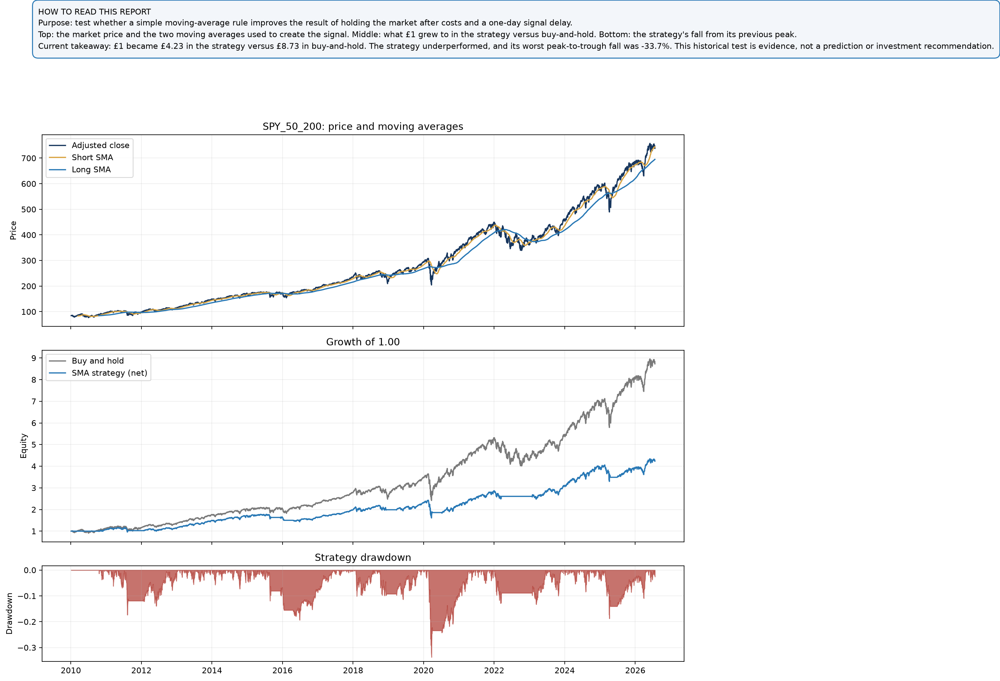

# MelQuantLab

Analyze. Model. Alpha.

This repository documents my development in quantitative research, trading,
portfolio analysis and financial-data engineering. Each project is designed as
a reproducible research decision pack rather than a guaranteed-profit claim.

## Project 1: Systematic Moving-Average Crossover Backtester

Status: **Python MVP complete and verified**

Next stage: Excel/VBA dashboard and weekly PDF/email automation.

The first project tests a transparent long-or-cash trend-following rule. When
the short simple moving average (SMA) is above the long SMA, the strategy holds
the instrument; otherwise, it holds cash.

The research question is:

> Can a simple SMA crossover improve the return-to-risk profile or reduce
> drawdown relative to buy-and-hold after signal delay and transaction costs?

### What the project currently does

- Downloads adjusted daily prices or reads a permitted local CSV.
- Calculates configurable short and long SMAs.
- Shifts the signal by one trading day to prevent look-ahead bias.
- Applies configurable transaction costs whenever the position changes.
- Compares net strategy performance with buy-and-hold.
- Reports annualised return, volatility, Sharpe ratio and maximum drawdown.
- Reports entries, exits, exposure and total modelled transaction costs.
- Exports an Excel-ready time-series CSV and metrics JSON.
- Generates a three-panel price, equity and drawdown chart.
- Tests signal timing, costs, compounding and invalid inputs.

### Research design

| Component | Current assumption |
| --- | --- |
| Strategy | Long or cash |
| Signal | Short SMA greater than long SMA |
| Execution timing | Signal calculated at close *t*, position applied on *t+1* |
| Return convention | Adjusted-close percentage return |
| Benchmark | Buy-and-hold in the same instrument |
| Transaction cost | Applied in basis points to absolute position turnover |
| Annualisation | 252 trading days |
| Cash return | Zero, unless represented through the risk-free-rate assumption |

### Reproducible SPY demonstration

A 50/200-day demonstration was run on publicly downloaded adjusted SPY data
from 4 January 2010 through 23 July 2026 with a 5 bp cost per position change.

| Metric | SMA strategy | Buy-and-hold |
| --- | ---: | ---: |
| Total return | 323.24% | 772.77% |
| Annualised return | 9.13% | 14.01% |
| Annualised volatility | 13.97% | 17.10% |
| Sharpe ratio (0% risk-free rate) | 0.70 | 0.85 |
| Maximum drawdown | -33.72% | -33.72% |

The strategy underperformed buy-and-hold in both total return and Sharpe ratio
over this sample. It also spent approximately 79.77% of days invested. This is
a useful negative result: the rule is understandable and reproducible, but the
current evidence does not establish an investable edge.

### Plain-English report

The box at the top explains the purpose of the test, how to read each panel and
the current conclusion. The figures update automatically whenever a new report
is generated.



These figures are a historical methodology demonstration, not investment
advice, live performance or a claim that the strategy will remain effective.
Results depend on data quality, assumptions, sample period and implementation.

## Installation

Python 3.11 or later is required.

```bash
python3 -m venv .venv
source .venv/bin/activate
python -m pip install -e ".[dev]"
```

## Run the backtester

Using Yahoo Finance:

```bash
melquant-sma \
  --ticker SPY \
  --start 2010-01-01 \
  --end 2026-07-25 \
  --short-window 50 \
  --long-window 200 \
  --transaction-cost-bps 5 \
  --output-dir reports/spy_50_200
```

Using a CSV containing `Date` and `Close` columns:

```bash
melquant-sma \
  --csv data/raw/prices.csv \
  --short-window 50 \
  --long-window 200 \
  --output-dir reports/local_test
```

Generated reports are intentionally excluded from version control. This avoids
publishing stale data or presenting generated output as source code.

## Run the tests

```bash
pytest
```

## Repository structure

```text
quant-lab/
├── data/raw/                  # Local inputs; contents are not committed
├── docs/images/               # Curated public research figures
├── reports/                   # Generated CSV, JSON and PNG outputs
├── src/melquantlab/
│   ├── backtest.py            # Signal, returns, costs and metrics
│   ├── cli.py                 # Command-line workflow
│   ├── data.py                # CSV and Yahoo Finance loaders
│   └── reporting.py           # Excel-ready exports and charts
└── tests/                     # Automated correctness checks
```

## Known limitations and next steps

- Yahoo Finance is convenient public data, not an institutional data source.
- Taxes, bid-ask variation, market impact and execution slippage are simplified.
- Cash returns and dividends are represented only through adjusted prices and
  the configured assumptions.
- The current project tests one instrument and one parameter pair at a time.
- Parameter sensitivity, regime analysis and out-of-sample validation remain
  future extensions and must not be used to select a winner retrospectively.
- An Excel/VBA dashboard and weekly PDF/email workflow are planned for the next
  development stage.

## Research standard

Every MelQuantLab project should make the hypothesis, data, assumptions,
timing, costs, risks, limitations and rejection condition visible. Failed or
unconvincing results are retained because honest negative evidence is part of
the research process.
