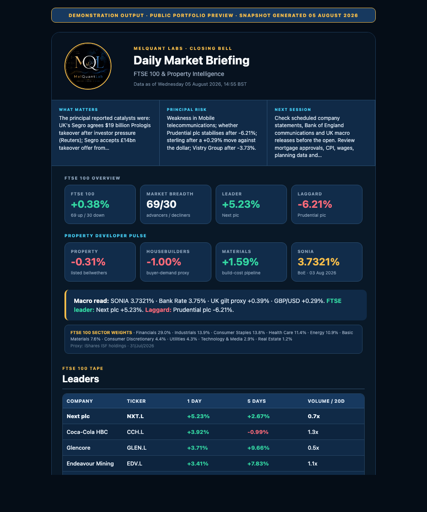

# Market Basket Monitor

A Python-based market monitoring workflow for macOS that tracks a configurable basket of securities, identifies significant price movements, gathers relevant news, and maintains an Excel dashboard for ongoing review.

It also includes a weekday **FTSE 100 Property Developer Closing Bell**. The briefing starts with a clean FTSE overview and a separate property-developer pulse, then maps the market directly to a developer's decisions: capital and finance, materials and infrastructure, real-estate bellwethers, housebuilder competition, consumer spending power and the next-session watchlist. An Alpha View turns the latest news, market tape and upcoming catalysts into clearly labelled one-day, one-week, 14-day and one-month research hypotheses. The 14-day lens concentrates on earnings, company statements and scheduled macro events. A sub-500-word closing note leads with the immediate actions and then adds concise autos, financials, technology and macro summaries.

The configurable intraday alert monitor still uses Auto Trader Group (`AUTO.L`) as its simple example basket. It is independent of the property-focused daily closing briefing and can be expanded to other instruments.

## Daily briefing preview

The monitor produces a branded, property-focused FTSE 100 closing briefing every weekday. The public example below is a demonstration snapshot: it contains no credentials, email addresses or private delivery settings.



[Open the full HTML example](docs/daily-briefing-preview.html)

## Project purpose

Market data is most useful when it is delivered consistently and placed in context. This monitor brings together price checks, movement alerts, recent news, and weekly history in one lightweight workflow.

It is designed to demonstrate:

- automated market-data collection;
- event-driven price monitoring;
- persistent state between runs;
- structured Excel reporting;
- scheduled macOS execution; and
- email and desktop delivery.

Python handles the data and automation layer, while Excel provides a familiar review interface.

## Key features

### Price monitoring

- Retrieves current and previous closing prices through Yahoo Finance.
- Calculates the daily percentage move for each instrument.
- Compares the latest price with the stored monitoring reference.
- Applies a configurable alert threshold.
- Continues processing the remaining basket if one ticker cannot be retrieved.

### Alerts and reporting

- Displays native macOS notifications when a threshold is reached.
- Sends HTML email alerts with price information and related headlines.
- Produces a scheduled weekly market summary.
- Records monitoring state locally between runs.

### Excel dashboard

Each run creates or updates `basket_dashboard.xlsx` with three worksheets:

| Worksheet | Purpose |
| --- | --- |
| `Live` | Latest price, daily move, movement from the stored reference, alert status, and update time |
| `Weekly History` | One observation per ticker for each weekly run |
| `News` | Recent headlines, publication times, and clickable source links |

Positive and negative moves are colour-coded, while triggered alerts are highlighted for quick review.

### Automation

Three sample macOS `launchd` configurations are included:

- `com.melquantlabs.marketmonitor.alert.plist` runs the monitoring check every 30 minutes.
- `com.melquantlabs.marketmonitor.daily.plist` checks once per minute and begins validating the FTSE 100 property-developer briefing after 16:50, Monday to Friday, using the Mac's local time zone. Delivery requires two identical complete snapshots at least three minutes apart, so the normal arrival is shortly after 16:53. A private success marker prevents duplicate delivery and allows automatic recovery after sleep or a temporary connection failure.
- `com.melquantlabs.marketmonitor.weekly.plist` runs the weekly digest each Monday at 08:00.

An optional VBA module and AppleScript helper provide manual refresh controls from Excel for Mac.

## Project structure

```text
market_basket_monitor/
├── market_monitor.py
├── daily_ftse_digest.py
├── config.py
├── requirements.txt
├── test_market_monitor.py
├── test_daily_ftse_digest.py
├── .env.example
├── AutoMonitor.bas
├── RunPythonMonitor.applescript
├── com.melquantlabs.marketmonitor.alert.plist
├── com.melquantlabs.marketmonitor.daily.plist
└── com.melquantlabs.marketmonitor.weekly.plist
```

Runtime files such as `.env`, `last_prices.json`, logs, and the generated Excel workbook are excluded from version control.

## Installation

From the repository root:

```bash
cd market_basket_monitor
python3 -m venv venv
source venv/bin/activate
pip install -r requirements.txt
cp .env.example .env
```

Open `.env` and enter the email account details used for delivery:

```text
BT_EMAIL_USER=your-email@example.com
BT_EMAIL_PASSWORD=your-app-password
EMAIL_FROM=your-email@example.com
EMAIL_FROM_NAME=MelQuant Labs
EMAIL_TO=first-recipient@example.com,second-recipient@example.com
```

Separate multiple recipients with commas. Recipients are delivered through the private SMTP envelope and are not exposed in the visible `To` header. `EMAIL_FROM_NAME` controls the professional sender name shown by the recipient's mail application. Keep `.env` private: it is already excluded by `.gitignore` and should never be committed.

## Configuration

Edit `config.py` to define the monitored basket and alert sensitivity:

```python
BASKET_NAME = "Autotrader Group"

TICKERS = [
    "AUTO.L",
]

ALERT_THRESHOLD_PCT = 3.0
```

Yahoo Finance symbols can be added to `TICKERS`, for example:

```python
TICKERS = [
    "AUTO.L",
    "RR.L",
    "TSCO.L",
]
```

## Running the monitor

Run a price and alert check:

```bash
python3 market_monitor.py --mode check
```

Generate the weekly dashboard update and email digest:

```bash
python3 market_monitor.py --mode weekly
```

Build the daily FTSE 100 property-developer briefing without sending it:

```bash
python3 daily_ftse_digest.py --dry-run
```

Build and email the briefing:

```bash
python3 daily_ftse_digest.py
```

The Excel dashboard is written to the project directory after a successful run. If it is open and locked by Excel, the monitor reports a warning and retries during the next run.

## Scheduling on macOS

Before installing the supplied `launchd` files, replace every instance of:

```text
/path/to/market_basket_monitor
```

with the absolute location of the project on your Mac.

Copy and load the schedules:

```bash
cp com.melquantlabs.marketmonitor.alert.plist ~/Library/LaunchAgents/
cp com.melquantlabs.marketmonitor.weekly.plist ~/Library/LaunchAgents/
cp com.melquantlabs.marketmonitor.daily.plist ~/Library/LaunchAgents/
launchctl load ~/Library/LaunchAgents/com.melquantlabs.marketmonitor.alert.plist
launchctl load ~/Library/LaunchAgents/com.melquantlabs.marketmonitor.weekly.plist
launchctl load ~/Library/LaunchAgents/com.melquantlabs.marketmonitor.daily.plist
```

The daily job uses the Mac's current time zone. Keep the Mac awake and connected to the internet around 16:40. If it is asleep at the scheduled time, macOS normally starts the missed calendar job after the Mac wakes.

Unload them when required:

```bash
launchctl unload ~/Library/LaunchAgents/com.melquantlabs.marketmonitor.alert.plist
launchctl unload ~/Library/LaunchAgents/com.melquantlabs.marketmonitor.weekly.plist
```

Execution logs are written to the `/tmp` paths defined in each property-list file.

## Optional Excel controls

`AutoMonitor.bas` and `RunPythonMonitor.applescript` provide an optional Excel-for-Mac control layer.

To use it:

1. Copy `RunPythonMonitor.applescript` to `~/Library/Application Scripts/com.microsoft.Excel/`.
2. Import `AutoMonitor.bas` through the Visual Basic Editor in Excel.
3. Update the three path constants at the top of the VBA module.
4. Save the workbook as an Excel Macro-Enabled Workbook (`.xlsm`).
5. Assign `RefreshNow` or `RunWeeklyDigestNow` to worksheet buttons.

macOS may request permission for Excel to run the AppleScript helper.

## Data sources and limitations

- Price data is provided by Yahoo Finance through `yfinance` and may be delayed, incomplete, or revised.
- News is discovered through Google News RSS, attributed to its publisher and ranked to favour sources such as Reuters, Bloomberg, the Financial Times, Yahoo Finance and established UK outlets. The monitor receives headline metadata and links only: it does not read or summarise the full Bloomberg, Financial Times or Reuters article body, and paywalls are not bypassed.
- The 14-day Alpha View only names a catalyst when a specific attributed forward-looking headline is returned. If none is found, it says so rather than substituting a generic calendar instruction or fabricated investment idea.
- Before any email is sent, the monitor requires at least 90 FTSE constituents carrying the current London market date. Stale or materially incomplete price data causes the delivery to fail and retry rather than presenting old figures as today's close.
- Official SONIA and Bank Rate observations come from the Bank of England statistical database and display their observation dates.
- Broad FTSE 100 sector weights are sourced from the latest public sector breakdown for the iShares Core FTSE 100 UCITS ETF (ISF) and are labelled as an index-tracker proxy with their observation date.
- The Daily PM Summary combines the calculated FTSE tape with financing, property, housebuilder, materials and consumer proxies plus attributed headlines. Forward-looking headlines are included only when explicitly relevant to the UK market or property-development environment; otherwise the report supplies a general watchlist and asks the reader to verify dates at the original source.
- Planning approvals, mortgage approvals, CPI, wages and RICS surveys update less frequently than markets. They are treated as dated release-watch items rather than fabricated daily readings.
- The monitor runs locally and therefore depends on the Mac being powered on with network access.
- It is a research and monitoring tool, not an execution system or source of investment advice.
- The current version uses a straightforward percentage threshold rather than a statistically calibrated risk model.

## Planned development

- Expand automated tests to cover data-provider failures and email delivery.
- Separate data, reporting, delivery, and orchestration into dedicated modules.
- Introduce market-session awareness and more precise scheduling.
- Add richer cross-asset indicators and configurable signal rules.
- Extend the dashboard with historical charts and signal attribution.

## Technology

- Python
- pandas-compatible Yahoo Finance data through `yfinance`
- OpenPyXL
- Google News RSS
- SMTP over SSL
- macOS `launchd`, AppleScript, and optional Excel VBA

## Disclaimer

This project is provided for educational and research purposes. It does not constitute investment advice, and its outputs should be independently verified before being used in any financial decision.
